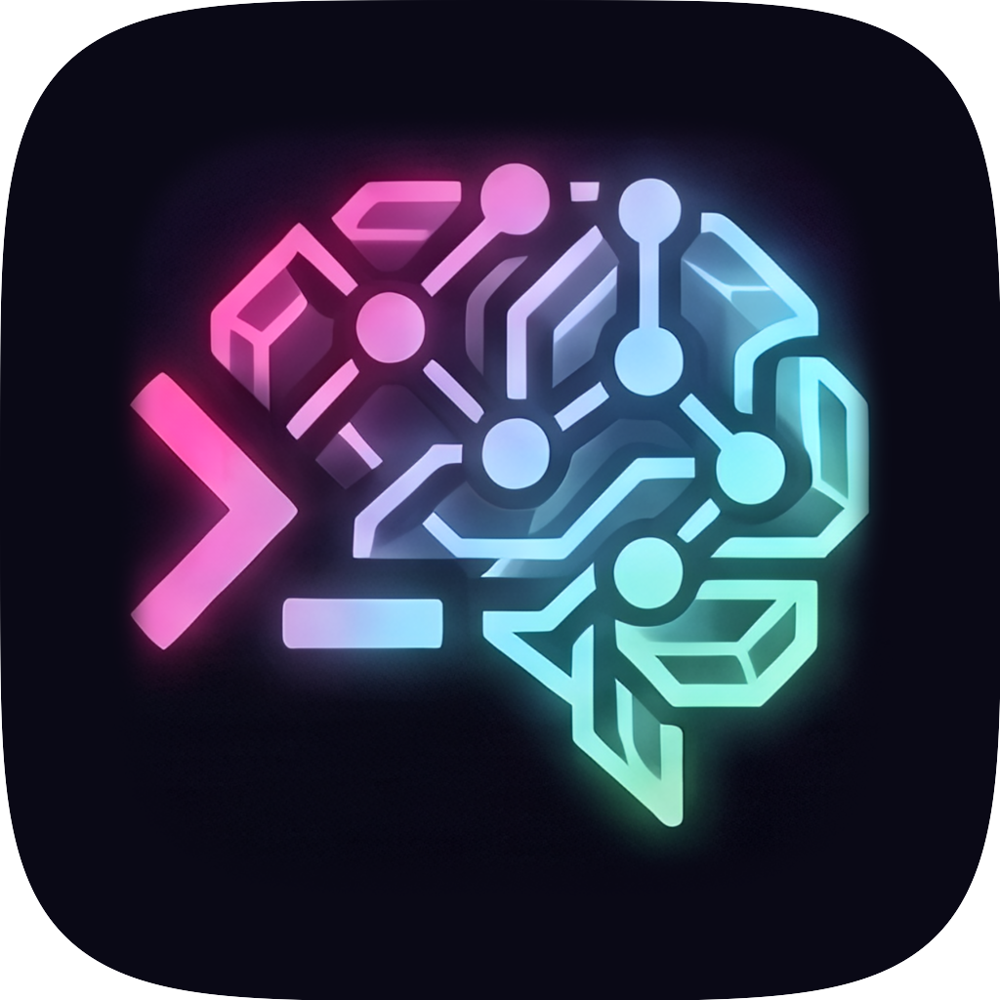

# Codez

A macOS desktop app for running [Claude Code](https://docs.anthropic.com/en/docs/claude-code) sessions in parallel. Native Electron shell with persistent sessions, drag-and-drop reordering, themes, and auto-updates.



## Install

Download the latest `.dmg` from [Releases](https://github.com/dakl/codez/releases/latest), open it, and drag Codez to Applications.

Codez checks for updates automatically and will notify you when a new version is available.

### Prerequisites

- **macOS** (Apple Silicon)
- **Claude Code CLI** installed and authenticated — [install guide](https://docs.anthropic.com/en/docs/claude-code/getting-started)

## What it does

Codez wraps the Claude Code CLI in a native app with session management. Each session is a full Claude Code conversation running in its own PTY (terminal emulator), so you can run multiple agents in parallel across different repos.

### Features

- **Parallel sessions** — run multiple Claude Code conversations side by side
- **Persistent history** — sessions survive app restarts; resume where you left off
- **Drag-and-drop reordering** — organize sessions manually in the sidebar
- **Session archiving** — archive finished sessions, restore them later
- **Themes** — 6 built-in themes (3 dark, 3 light)
- **Custom app icons** — 9 icon variants to choose from
- **Keyboard shortcuts** — Cmd+1..9 to jump between sessions, customizable bindings
- **Auto-updates** — notifies when new versions are available on GitHub Releases

### Roadmap

- Voice input via local Whisper STT
- Git worktree isolation per session
- File diff review before committing
- Additional agents (Gemini CLI, Mistral Vibe)

## Development

```bash
git clone https://github.com/dakl/codez.git
cd codez
npm install
npm run dev
```

This rebuilds native modules, compiles TypeScript, starts the Vite dev server, and launches Electron with hot reload.

### Commands

| Command | Description |
|---------|-------------|
| `npm run dev` | Start dev mode (main + renderer + Electron) |
| `npm run build` | Production build |
| `npm test` | Run tests (vitest) |
| `npm run lint` | Biome lint check |
| `npm run format` | Biome format |

### Tech Stack

| Layer | Technology |
|-------|-----------|
| Runtime | Electron 40 |
| UI | React 19, TypeScript, Tailwind CSS 4 |
| State | Zustand 5 |
| Build | Vite (renderer), tsc (main) |
| Database | better-sqlite3 (SQLite, WAL mode) |
| Terminal | node-pty |
| Drag & Drop | @dnd-kit |
| Lint/Format | Biome |
| Tests | Vitest |
| Packaging | electron-builder |

### Architecture

```
src/
├── shared/        # Types + IPC channel constants
├── main/          # Electron main process
│   ├── db/        # SQLite schema, migrations, queries
│   ├── agents/    # Agent adapters (Claude Code)
│   └── services/  # PTY manager, session lifecycle
└── renderer/      # React UI
    ├── stores/    # Zustand state
    ├── hooks/     # Keyboard shortcuts, etc.
    └── components/
```

Claude Code runs in `-p` (pipe) mode — each turn spawns a process that streams NDJSON events and exits on completion. Multi-turn conversations use `--resume` to continue the session.

## License

MIT
